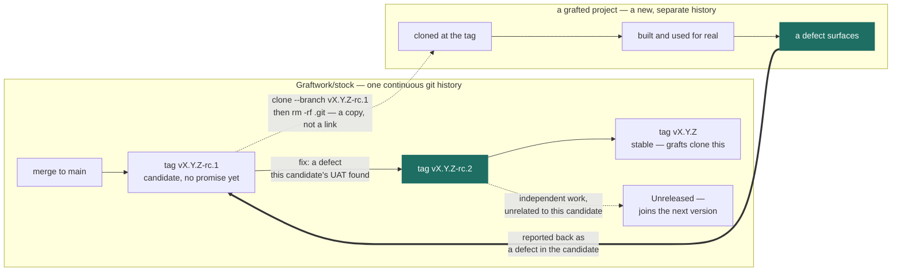

# Releasing

[`WORKFLOW.md`](../WORKFLOW.md) is how a change is *run*. This is how a change
gets *out* — the sequence from branch to tag to the projects that need it.

Stock's own process is below. A grafted project needs its own; keep this file,
replace the specifics. Most projects can drop the re-sync step and keep the rest.

## Which route a change takes

Not every change earns the full ceremony. The test is what it touches.

| The change touches | Route |
| --- | --- |
| `openspec/specs/`, `scripts/`, or `tests/` | **Full OpenSpec change** — propose, apply, UAT, archive. Main specs are written by archiving, never by hand. |
| Docs, CI, `mise.toml`, `.pre-commit-config.yaml`, permissions | **Direct** — branch, commit, PR. The CHANGELOG entry is the record. |

The split is deliberate: the verification layer is the thing Stock exists to
provide, so changes to it go through the flow Stock ships. A CI action bump does
not need a design document.

If you are unsure, ask whether the change alters a promise. Promises go through
OpenSpec.

**Cutover:** this rule starts at v0.2.0 and is not applied backwards. v0.2.0
itself edited `openspec/specs/foundation/spec.md` directly, because it is the
change that introduced the rule — it could not have followed it. Retrofitting an
archived change for it would be a fabricated record, which is worse than an
honest gap. Everything after v0.2.0 follows the table.

## The sequence

### 1. Branch

```bash
git fetch origin main && git checkout -b <topic> origin/main
```

Never commit to `main` directly. Up to and including v0.1.2 that is exactly what
happened — `main` is a linear run of direct commits with no merges — and the
practice stops here.

### 2. Run the change

Per the route table above. If it is a full OpenSpec change, the specs are updated
by `/opsx:archive`, not by editing `openspec/specs/` yourself.

### 3. Get it green

```bash
mise run check          # lint + test, everything CI runs
uvx pre-commit run --all-files
```

### 4. Run UAT — before the PR, not after

Work [`docs/UAT.md`](UAT.md), run the cases you can, and record what you saw.
Cases marked *needs a published tag* cannot run yet; leave them for step 8. Reporting a case as open
is the correct outcome — an agent may run the commands and report, but may not
mark a case passed.

### 5. Decide the version and write the CHANGELOG entry

The rule is stated in [`CHANGELOG.md`](../CHANGELOG.md) and repeated here because
it is the decision most often got wrong:

- **major** — a grafted project needs manual intervention to re-sync
- **minor** — the migration is additive; a project that adopts none of it stays green
- **patch** — a fix that changes no interface

The entry is not release notes. **It is the migration instruction** for every
already-grafted project, and it is the only thing standing between "re-sync to
Stock vX" and an archaeology exercise. Write it for someone holding a project
three versions behind.

Bump the version everywhere it appears, and **only where it tracks the current
version**. Measured at v0.2.0: 13 occurrences across 6 files, of which 5 must
move and the rest are permanent statements about the past — a blanket
find-and-replace corrupts the record while looking correct. The breakdown is in
the backlog stub at `openspec/changes/version-string-consistency/`. Until that is
built, this step is manual and easy to get wrong in both directions:

```bash
grep -rn "$OLD_VERSION" --include="*.md" --include="*.toml" .
```

### 6. Open the PR

Disclose the coding agent and the model. This is not etiquette — it is a
published requirement of the `foundation` spec (*AI Authorship Is Disclosed*),
and it is declared as a review-policy gap in `[tool.graftwork.traceability]`
precisely because no test can enforce it. The only thing keeping it true is
someone doing it.

### 7. Merge, then cut a release candidate

```bash
git checkout main && git pull origin main
git tag -a v<X.Y.Z>-rc.1 -m "v<X.Y.Z>-rc.1"
git push origin v<X.Y.Z>-rc.1
```

**Not the final tag yet.** Some UAT cases need a real published tag to run
against — you cannot rehearse "clone Stock at a tag and graft a project from it"
without a tag to clone. Cutting the stable tag first would mean the release is
already made by the time you find out whether it is any good, and a stable tag
that turns out to be wrong cannot be moved: someone may already have grafted from
it, and the whole point of a tag is that it does not move.

A release candidate breaks that circle. It is a real, cloneable tag, so the graft
UAT is the genuine article rather than a rehearsal — but it carries no promise,
so nothing is committed to.

Semver orders pre-releases before the release they precede, so `v0.3.0-rc.1` sorts
below `v0.3.0` and never gets mistaken for it.

The `README.md` graft snippet keeps naming the **stable** tag throughout. An rc is
for the person running UAT, not for anyone starting a project.

### 8. Run the tag-dependent UAT cases against the candidate

Clone the rc tag and work the cases marked *needs a published tag*. This is the step that
was, until now, impossible to do before releasing. A real graft attempted from
the candidate — by a person or an agent, not necessarily as a formal UAT run —
counts as this step too; a bug it finds is exactly what the step exists to catch.

- **All good** → go to step 9.
- **Something is wrong** → fix it on a new branch, merge, and cut `-rc.2`. The rc
  tags stay in the repository as an honest record of what was tried; they cost
  nothing and deleting them would only obscure the history.

  **The fix belongs to *this* version, not the next one.** Amend the existing
  `[X.Y.Z]` CHANGELOG entry rather than opening a new `[Unreleased]` section —
  the entry describes what the release will contain once a candidate finally
  passes, and this release does not yet exist to have shipped without the fix.
  `pyproject.toml` stays at the version being released; only the tag suffix
  changes, `-rc.1` to `-rc.2`.

  This is easy to get backwards. A defect a candidate's own UAT surfaces is not
  the same thing as unrelated new work that happens to land while a candidate
  is outstanding — only the second kind is genuinely `[Unreleased]`:

  | | Defect UAT found in the candidate | Independent new work |
  | --- | --- | --- |
  | Belongs to | This version — merge, `-rc.2` | The next version |
  | CHANGELOG | Amend the existing `[X.Y.Z]` entry | New `[Unreleased]` section |

  Confusing the two means the version that eventually ships may never have
  actually been tested — the failure this whole step exists to prevent.



Stock and a grafted project are separate git histories from the moment of the
clone — nothing flows back on its own. A finding from a graft returns only as a
manual report, and this step is the fork in what happens to it: the highlighted
path is a defect in the exact candidate under test, folded back into the same
release; the plain path is everything else, which waits for the next one.

Record `Last agent run` for what was executed; **`Last passed` stays for the
person who looked.**

### 9. Tag the release

```bash
git tag -a v<X.Y.Z> -m "v<X.Y.Z>" <the same commit the passing rc points at>
git push origin v<X.Y.Z>
```

Tag on `main`, never on a branch, and on **the exact commit the passing candidate
pointed at** — otherwise you have released something no one ran UAT against, and
the candidate proved nothing.

The tag is what
[the graft instructions](../README.md#grafting-a-project-from-stock) clone, so a
missing or misplaced tag breaks new projects rather than existing ones — a
failure nobody already in the repository will ever notice.

### 10. Push the migration outward

Every entry in the CHANGELOG is work waiting to happen in every grafted project.
Read each project's recorded `stock-version` in its `pyproject.toml`, read this
CHANGELOG forward from there, and open one small PR per entry.

**There are currently no live grafts.** The first one was retired before v0.2.0
shipped, so this step has nothing to do yet — which is also why
[Stock ADR 0008](decisions/stock-0008-adr-numbering.md) could renumber Stock's
own ADRs at no cost to anyone.

Keep the list of grafts here as they appear, and record which Stock version each
one has reached. Nothing tracks whether a migration has landed; if that becomes a
problem before someone builds something better, the honest fix is a checklist in
the CHANGELOG entry itself.

## Why it is worth this much

A change to Stock is not a change to one repo. It is a change to every project
grafted from it, arriving later, applied by someone who was not in the room. The
CHANGELOG entry and the tag are the entire interface for that person.
